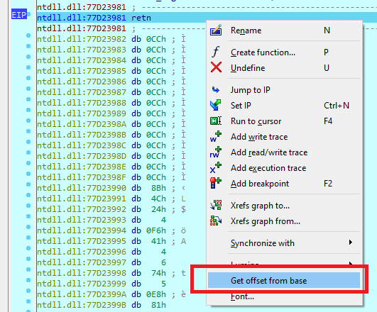
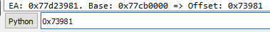
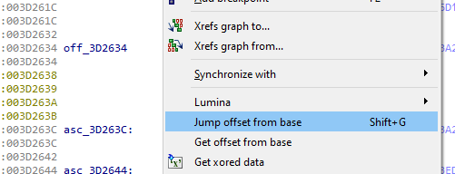
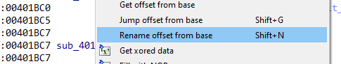
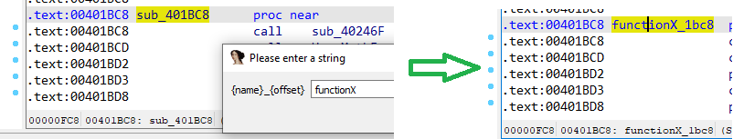

# ofb

idapython plugin

- get binary offset from current image/module base and copy to clipboard

- jump to an offset from current image/module base (Shift + G)

- change current name to string pattern that supports offset. default: `{name}_{offset}`

- work in both debuging & analysing mode

useful for sharing offset with other people or different IDA remote debug & static analysis view.

# instruction

Copy `ofb.py` to `plugins` directory of IDA

---

*Optional:* To change the default template, fix constant `NAME_TEMPLATE` in `ofb.py`. Only support
- `{name}` => your input name
- `{offset}` => offset from base

Eg: `zzz_{offset}_{name}` => `zzz_a0b1_Myname`
